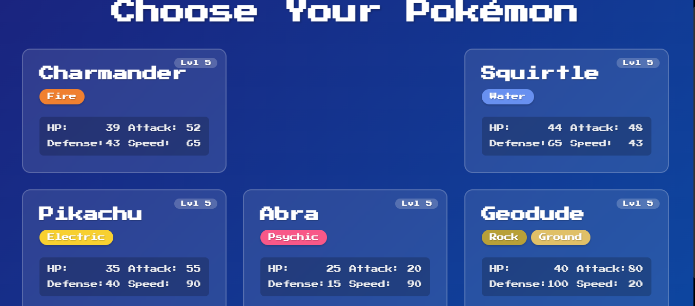

# Pokémon Battle Simulator

A web-based Pokémon battle simulator that lets you battle with your favorite Pokémon! Built with React, TypeScript, and FastAPI.

## Features

- Choose from 6 different Pokémon (Charmander, Bulbasaur, Squirtle, Pikachu, Abra, and Geodude)
- Battle against a randomly selected opponent
- Type-based damage calculation with effectiveness messages
- Beautiful, responsive UI with animations
- Battle results screen with winner statistics
- Play again functionality

## Screenshots

### Pokémon Results Screen


### Battle Selection Screen


## Project Structure

```
Pokemon-Simulator-API/
├── backend/
│   ├── app/
│   │   ├── __init__.py
│   │   ├── main.py
│   │   └── data.py
│   ├── requirements.txt
│   └── README.md
├── frontend/
│   ├── public/
│   ├── src/
│   │   ├── components/
│   │   │   ├── Battle.tsx
│   │   │   ├── PokemonSelection.tsx
│   │   │   └── BattleResults.tsx
│   │   ├── types/
│   │   │   └── pokemon.ts
│   │   ├── App.tsx
│   │   ├── data.ts
│   │   └── index.css
│   ├── package.json
│   └── README.md
└── README.md
```

## Setup Instructions

### Backend Setup

1. Navigate to the backend directory:
   ```bash
   cd backend
   ```

2. Create a virtual environment and activate it:
   ```bash
   python -m venv venv
   source venv/bin/activate  # On Windows: venv\Scripts\activate
   ```

3. Install dependencies:
   ```bash
   pip install -r requirements.txt
   ```

4. Run the FastAPI server:
   ```bash
   uvicorn app.main:app --reload
   ```

The backend will be available at `http://localhost:8000`

### Frontend Setup

1. Navigate to the frontend directory:
   ```bash
   cd frontend
   ```

2. Install dependencies:
   ```bash
   npm install
   ```

3. Start the development server:
   ```bash
   npm start
   ```

The frontend will be available at `http://localhost:3000`

## How to Play

1. Start the application and you'll see the Pokemon selection screen
2. Choose your Pokemon from the available options
3. Enter battle against an AI opponent
4. Select moves during your turn
5. Watch the battle unfold with animations and health updates
6. Win or lose, you can start a new battle!

## Available Pokemon

Currently implemented Pokemon:
- Charmander (Fire)
- Bulbasaur (Grass)
- Squirtle (Water)
- Pikachu (Electric)
- Abra (Psychic)
- Geodude (Rock/Ground)

## Contributing

1. Fork the repository
2. Create a feature branch
3. Commit your changes
4. Push to the branch
5. Create a Pull Request